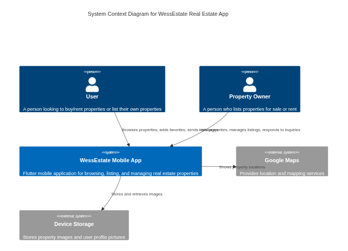
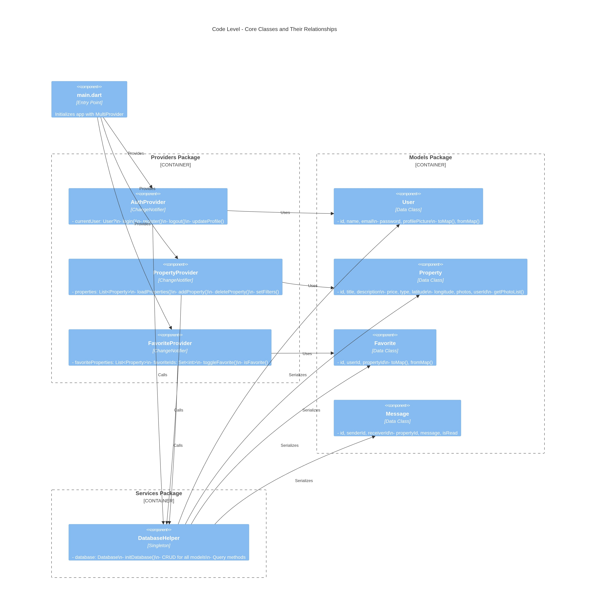
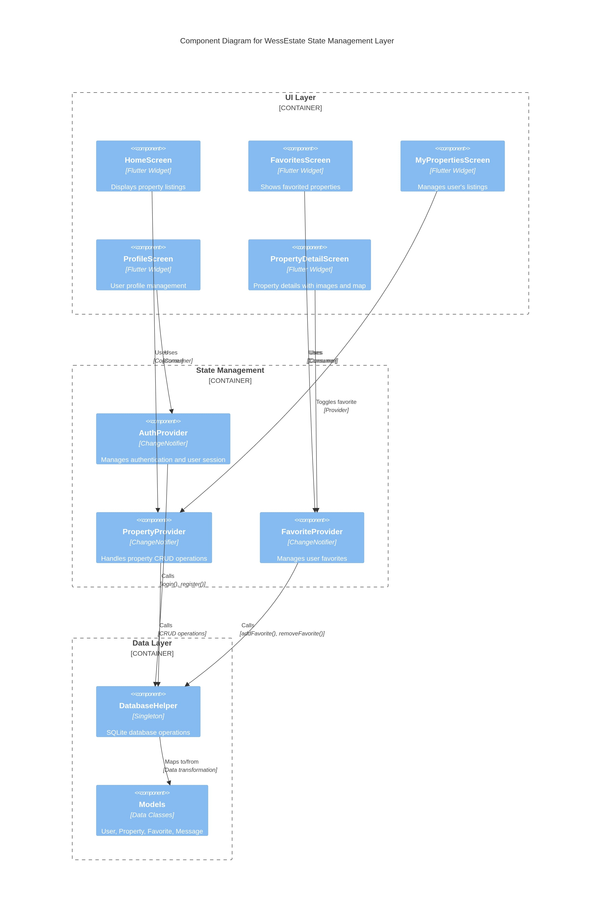

# Estate App - Real Estate Platform 🏠

A complete Flutter mobile application for real estate management with local SQLite database.

## 🌟 Features

- ✅ User Authentication (Register/Login with hashed passwords)
- ✅ Property Management (Add/Edit/Delete/View properties)
- ✅ Google Maps Integration (Select and view property locations)
- ✅ Photo Management (Multiple photos per property)
- ✅ Advanced Filtering (By price, type, location)
- ✅ Favorites System (Save favorite properties)
- ✅ Messaging System (Chat with property owners)
- ✅ Profile Management (Update profile and picture)
- ✅ Modern UI/UX (Material Design 3)

## 🚀 Quick Start

1. **Install Dependencies**
   ```bash
   flutter pub get
   ```

2. **Configure Google Maps**
   - Get an API key from [Google Cloud Console](https://console.cloud.google.com/)
   - Add to `android/app/src/main/AndroidManifest.xml`:
     ```xml
     <meta-data
         android:name="com.google.android.geo.API_KEY"
         android:value="YOUR_API_KEY_HERE"/>
     ```

3. **Run the App**
   ```bash
   flutter run
   ```

## 📸 Screenshots

The app includes:
- Beautiful login and registration screens
- Property browsing with card-based layout
- Detailed property views with photo carousel
- Interactive maps for location selection
- Real-time messaging interface
- Favorites management

C4 modal screenshots:
  
  
  

(Place the images under `assets/images/` or adjust paths; if used in Flutter, add them to `pubspec.yaml` under `flutter.assets:`)

## 🛠️ Technology Stack

- **Framework**: Flutter 3.9.2+
- **State Management**: Provider
- **Database**: SQLite (sqflite)
- **Maps**: Google Maps Flutter
- **Security**: Crypto (SHA-256 password hashing)

## 📖 Documentation

- **[SETUP.md](SETUP.md)** - Detailed setup instructions
- **[IMPLEMENTATION.md](IMPLEMENTATION.md)** - Complete implementation details

## 🏗️ Project Structure

```
lib/
├── main.dart                 # App entry point
├── models/                   # Data models (User, Property, etc.)
├── providers/                # State management
├── screens/                  # UI screens
└── services/                 # Database and business logic
```

## ✨ Key Highlights

- **Offline-First**: All data stored locally
- **Secure**: Hashed passwords, form validation
- **Responsive**: Works on all screen sizes
- **Fast**: Optimized database queries
- **Clean Code**: Well-organized architecture

## 🎯 Usage

1. **Register** a new account or **Login**
2. **Browse** properties on the home screen
3. **Filter** by price range or type (rent/sale)
4. **Add** your own properties with photos and location
5. **Favorite** properties you like
6. **Message** property owners
7. **Manage** your profile and properties

## 🔧 Requirements

- Flutter SDK >=3.9.2
- Android Studio / Xcode
- Google Maps API key

## 📝 License

Educational project - Free to use and modify

## 🤝 Contributing

Feel free to submit issues and enhancement requests!

---

Built with ❤️ using Flutter

## Getting Started

This project is a starting point for a Flutter application.

A few resources to get you started if this is your first Flutter project:

- [Lab: Write your first Flutter app](https://docs.flutter.dev/get-started/codelab)
- [Cookbook: Useful Flutter samples](https://docs.flutter.dev/cookbook)

For help getting started with Flutter development, view the
[online documentation](https://docs.flutter.dev/), which offers tutorials,
samples, guidance on mobile development, and a full API reference.
